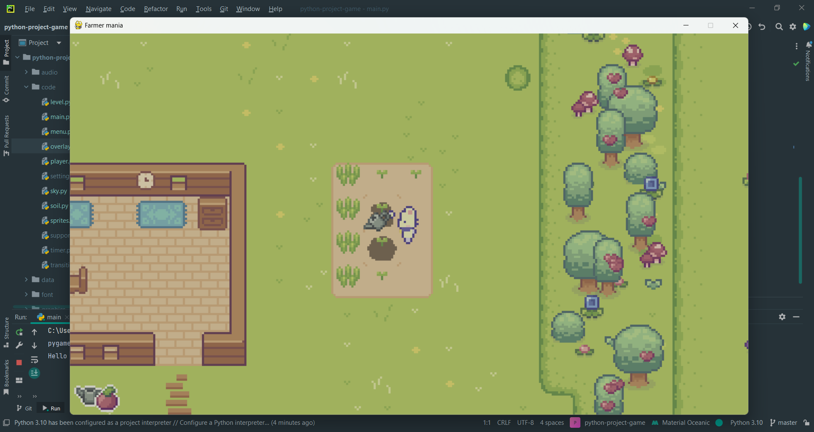
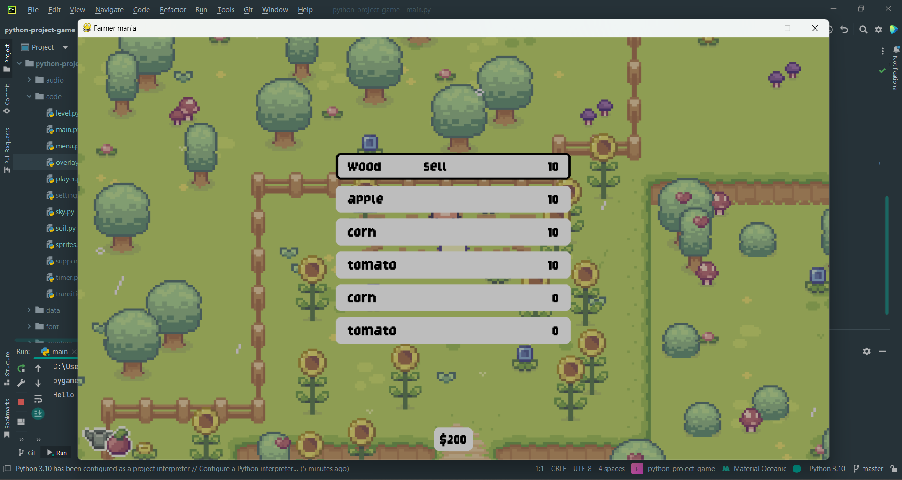
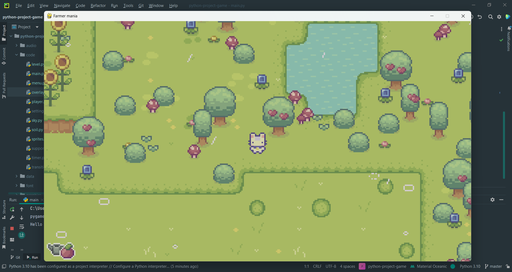
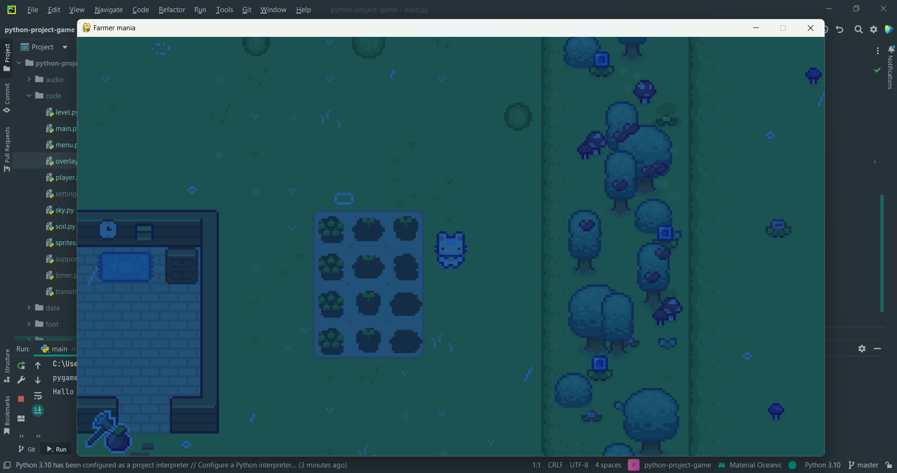

# Game made with Pygame

- Prerequisites : Python 3.10, pygame, pytmx.
- Assets: by [CUP NOOBLE](https://cupnooble.itch.io/sprout-lands-asset-pack)

## Features of a game
You can grow plants and sell them to merchant. Game has day/night transition. Weather conditions(rain).

## Keys
- W_KEY = move up
- A_KEY = move left
- D_KEY = move right
- S_KEY = move back
- Q_KEY = switch between tools
- E_KEY = switch between seeds
- SPACE_KEY = use tool
- CTRL_KEY = use seed
- ENTER_KEY = menu

## Screenshots

